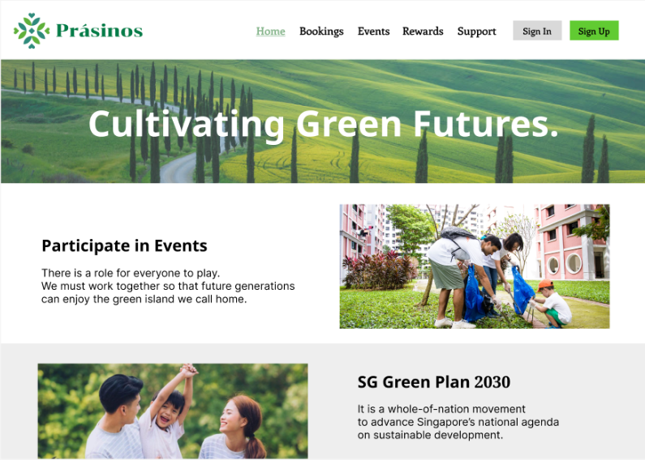

# Prasinos
<!-- ALL-CONTRIBUTORS-BADGE:START - Do not remove or modify this section -->

<!-- ALL-CONTRIBUTORS-BADGE:END -->

A sustainability themed application where users can participate in events to participate in sustainability initiatives, share ideas, and collaborate on projects. 

- Enable users and organisations to advertise events (E.g.: recycling drives and tree planting activities)
- Encourage active involvement and foster a sense of community ownership over sustainability efforts. 

- Provide information on sustainable practices (E.g.: waste reduction, energy conservation, water management, and green living tips)

- Help raise awareness among residents and empower them to adopt more sustainable behaviours through our platform.

___
### Task Allocation
Nicholas: [Account Management](https://github.com/bladeacer/NYP-FSDP/tree/accountManagement)

Manveer: [Event Management](https://github.com/bladeacer/NYP-FSDP/tree/eventManagement)

Branden: [Support Management](https://github.com/bladeacer/NYP-FSDP/tree/supportManagement)

Zara: [Booking System](https://github.com/bladeacer/NYP-FSDP/tree/bookingSystem)

Jun Long: [Rewards](https://github.com/bladeacer/NYP-FSDP/tree/rewardSystem)

___
#### Technical jargon
##### Front-end 
Create [Vite](https://vite.dev/guide/) App with React
- Tailwind.css
- Material UI
- Gemini API for Chatbot

##### Back-end
Back-end is written using Express.js
- Authentication is done with [JWTs](https://jwt.io/).

___
## Development 
The code uses a locally hosted MySQL database with placeholder credentials defined in the `.env` files. Hence, you would need to define your own credentials.
- Server [.env](./server/.env) file
    - APP_SECRET for JWTs to work
    - EMAIL_JS_PUBLIC_KEY, EMAIL_JS_SERVICE_ID, EMAIL_JS_TEMPLATE_ID for email notifications to work (obtain by creating an account with [EmailJS](https://www.emailjs.com/)
    > Note that there is a monthly quota of 200 emails per month on the free plan
- Client [.env](./client/.env) file
    - REACT_APP_GEMINI_API_KEY for chatbot

> This code is not deployed to a live website

To run it, you would have to install MySQL and provide the placeholder credentials. Alternatively, you can slightly modify the [index.js](./server/index.js) file to use an alternative database provider like SQLite.

## Contributions

<!-- ALL-CONTRIBUTORS-LIST:START - Do not remove or modify this section -->
<!-- prettier-ignore-start -->
<!-- markdownlint-disable -->
<table>
  <tbody>
    <tr>
      <td align="center" valign="top" width="14.28%"><a href="https://github.com/bladeacer"> <b>bladeacer</b></a> <a href="https://github.com/bladeacer/Prasinos/commits?author=bladeacer" title="Code">💻</a></td>
      <td align="center" valign="top" width="14.28%"><a href="https://github.com/Manveer04"> <b>Manveer04</b></a> <a href="https://github.com/bladeacer/Prasinos/commits?author=Manveer04" title="Code">💻</a></td>
      <td align="center" valign="top" width="14.28%"><a href="https://github.com/Ninjapro882"> <b>Branden</b></a> <a href="https://github.com/bladeacer/Prasinos/commits?author=Ninjapro882" title="Code">💻</a></td>
      <td align="center" valign="top" width="14.28%"><a href="https://github.com/233154G"> <b>Z T</b></a> <a href="https://github.com/bladeacer/Prasinos/commits?author=233154G" title="Code">💻</a></td>
      <td align="center" valign="top" width="14.28%"><a href="https://github.com/junlongg06"> <b>junlong</b></a> <a href="https://github.com/bladeacer/Prasinos/commits?author=junlongg06" title="Code">💻</a></td>
      <td align="center" valign="top" width="14.28%"><a href="https://github.com/features/security"> <b>Dependabot</b></a> <a href="#infra-dependabot" title="Infrastructure (Hosting, Build-Tools, etc)">🚇</a></td>
      <td align="center" valign="top" width="14.28%"><a href="https://allcontributors.org"> <b>All Contributors</b></a> <a href="#infra-all-contributors" title="Infrastructure (Hosting, Build-Tools, etc)">🚇</a></td>
    </tr>
  </tbody>
</table>

<!-- markdownlint-restore -->
<!-- prettier-ignore-end -->

<!-- ALL-CONTRIBUTORS-LIST:END -->

## Contributors ✨

Thanks goes to these wonderful people ([emoji key](https://allcontributors.org/docs/en/emoji-key)):

This project follows the [all-contributors](https://github.com/all-contributors/all-contributors) specification. Contributions of any kind welcome!
